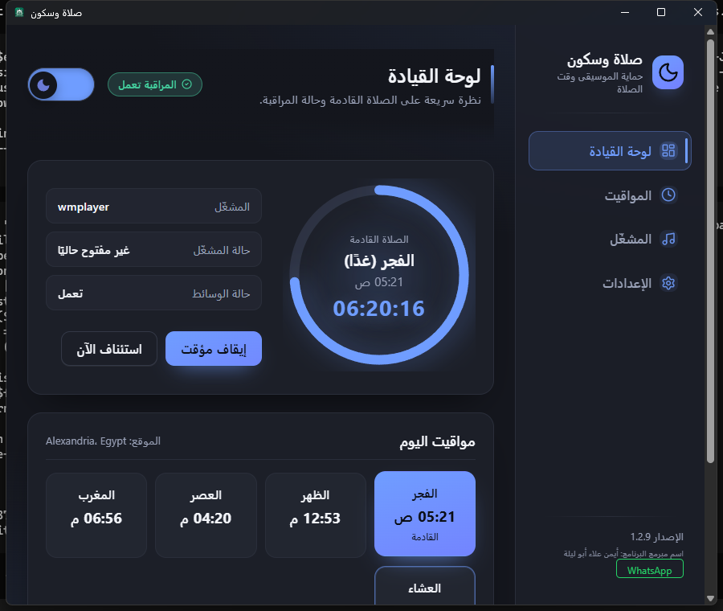
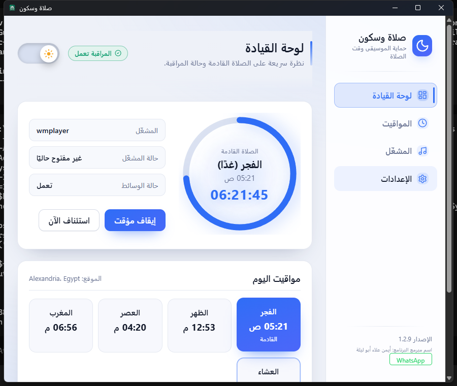
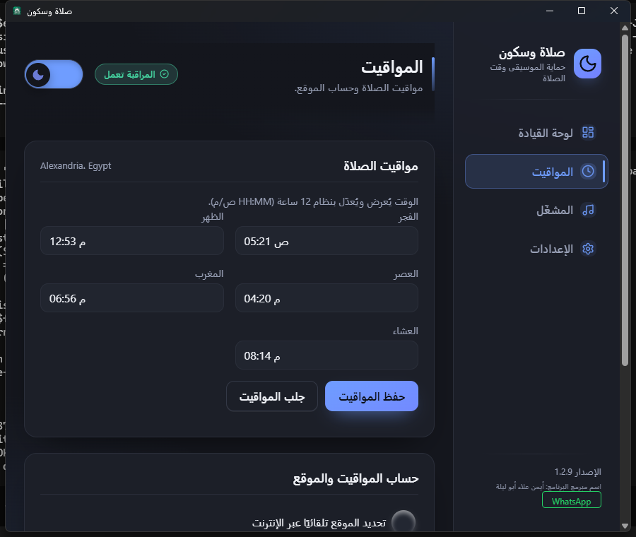
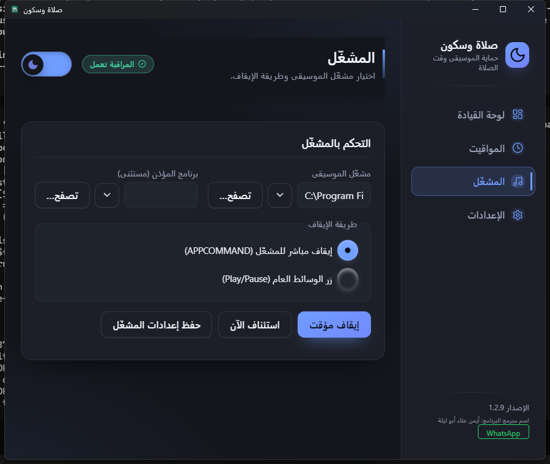
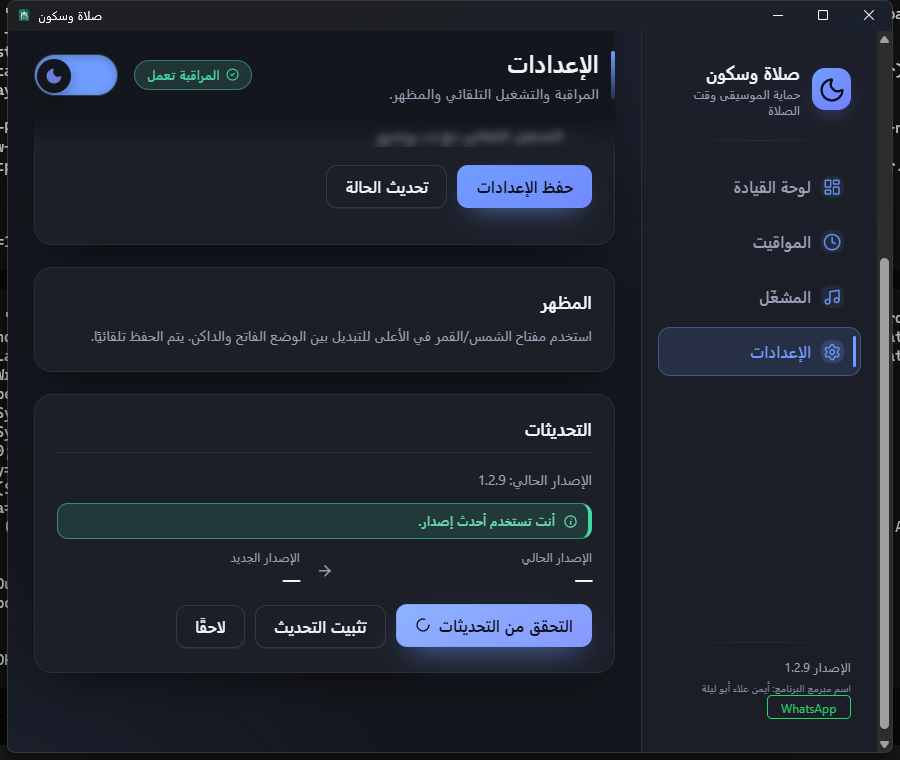
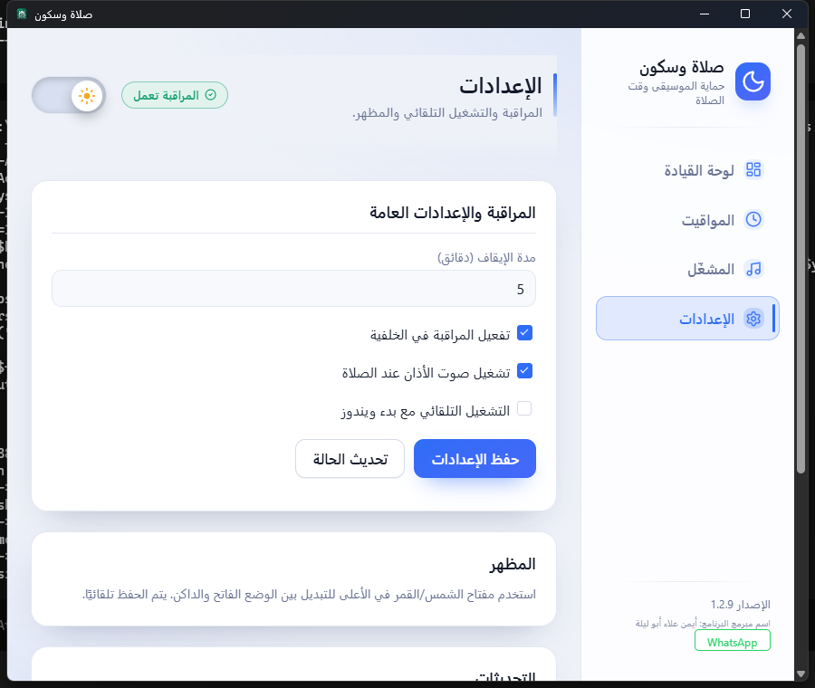

<div align="center">

# صلاة وسكون — PrayerMusicGuard

**تطبيق ويندوز يوقف مشغّل الموسيقى المختار تلقائياً عند أوقات الصلاة، ثم يُعيده بعد انتهائها.**

A Windows utility that automatically suspends your selected music player at prayer times
and resumes it when the prayer window ends.


**[Download the latest stable release →](https://github.com/sliveamer20/PrayerMusicGuard/releases)**

</div>

---

## Overview (English)

PrayerMusicGuard is a lightweight Windows utility for Muslims who listen to music or
audio on their computer. It watches the prayer schedule for your city and
**pauses your music player automatically when the prayer time arrives**, then
**resumes it once the configured period ends** — so you never have to remember to
mute your player yourself.

The interface is entirely **Arabic and right-to-left (RTL)**, built as a modern
WebView2 frontend with a **live next-prayer countdown**, a system-tray icon that keeps
monitoring running after the window is closed, and **light and dark themes**.

After the one-time setup (choose your player, choose your city, save) it runs quietly
in the background and needs no further attention.

<div align="center">

**اللغة العربية بالكامل • واجهة عصرية • يعمل بجانب الساعة • بدون أي تجسس أو إرسال بيانات**

</div>

---

## Screenshots

Real captures of the released v1.2.9 application.

<table>
  <tr>
    <td width="50%" align="center"><b>Dashboard — Dark</b><br>Live next-prayer countdown ring, player status, today's prayer times</td>
    <td width="50%" align="center"><b>Dashboard — Light</b><br>The same view in the light theme</td>
  </tr>
  <tr>
    <td width="50%"></td>
    <td width="50%"></td>
  </tr>
  <tr>
    <td width="50%" align="center"><b>Prayer Times &amp; Location</b><br>Country/city selection and the full prayer schedule</td>
    <td width="50%" align="center"><b>Music Player</b><br>Player selection, excluded athan program, and the pause method</td>
  </tr>
  <tr>
    <td width="50%"></td>
    <td width="50%"></td>
  </tr>
  <tr>
    <td width="50%" align="center"><b>Settings &amp; Updates</b><br>Monitoring options, theme, and the built-in update check</td>
    <td width="50%" align="center"><b>Settings — Light</b><br>General settings in the light theme</td>
  </tr>
  <tr>
    <td width="50%"></td>
    <td width="50%"></td>
  </tr>
</table>

---

## Features

- **Automatic pausing at prayer times** — the selected music player is suspended when
  the prayer window opens and resumed when it ends.
- **Live next-prayer countdown** on the dashboard, with a progress ring.
- **Configurable pause duration** (1–180 minutes) per prayer.
- **Arabic RTL interface** built on WebView2 (HTML/CSS/JS through `pywebview`).
- **Light and dark themes**, persisted independently of the Windows system theme.
- **Country / city selection** from bundled offline datasets (`assets/data`), or
  automatic location detection over the internet.
- **System-tray integration** — open the window, start/pause monitoring, resume the
  player, check for updates, or exit safely, all from the tray menu.
- **Optional athan audio** at prayer time, plus an excluded athan program so the
  prayer call itself is never paused.
- **Two pause methods** — direct application command (APPCOMMAND) or the generic
  Play/Pause media key.
- **Launch at Windows logon** (per-user, no administrator required).
- **Auto Update** — the app can check the official GitHub releases and offer to
  download and install a newer compatible release. *(Introduced in v1.2.9.)*
- **Windows 7 SP1 x64 → Windows 11** support, with a Tkinter fallback UI when the
  WebView2 runtime is unavailable.
- **No telemetry, no data collection** — prayer times are computed locally from the
  bundled datasets.

> **Safety:** the default mode *suspends* the selected player process — it never
> terminates it. See [Safety](#safety) below.

---

## How It Works

1. You choose the music player you use (for example, Windows Media Player).
2. You configure your location (country and city).
3. The application loads the prayer times for your city.
4. You set how long the pause should last and press **حفظ وتشغيل** (Save &amp; Run).
5. The application starts monitoring the prayer schedule from the system tray.
6. At the configured prayer period, your music player is suspended.
7. After the configured period ends, your player resumes normally.
8. Monitoring continues in the background — even when the main window is closed.

---

## Installation

The **installer is the recommended method** for normal users.

1. Open the latest release: **[PrayerMusicGuard releases](https://github.com/sliveamer20/PrayerMusicGuard/releases)**.
2. Download **`PrayerMusicGuard-Setup.exe`** from the latest release (v1.2.10).
3. Run the installer. It installs **per-user**, so **no administrator rights** are
   required.
4. Launch **صلاة وسكون** from the Start menu.
5. Follow the [First-Time Setup](#first-time-setup) below.

> Building from source is for developers only — see [Development](#development).

---

## First-Time Setup

1. Open **المشغّل** (the Player page) and select your music player, or use
   **تصفح…** (Browse) to pick its `.exe`.
2. **Do not** select the athan program as your music player — if you do, the prayer
   call would be paused along with your music. Set it as the excluded
   **برنامج المؤذن (مستثنى)** instead.
3. Open **المواقيت** (the Times page) and choose your country and city, or enable
   automatic location detection.
4. Press **جلب المواقيت** (Fetch prayer times) to load the schedule.
5. Open **الإعدادات** (Settings) and set the pause duration and whether the athan
   audio should play.
6. Press **حفظ وتشغيل** (Save &amp; Run).

**Closing the main window does not stop monitoring.** The application continues
running from the system-tray icon next to the clock.

---

## Daily Use

Once configured, the application needs no daily attention.

- **The app stays in the system tray** next to the clock after you close the window.
- **Open the main window** — left-click (double-click) the tray icon, or right-click
  and choose **فتح البرنامج** (Open).
- **Pause monitoring** — right-click the tray and choose **بدء/إيقاف المراقبة**.
- **Resume monitoring** — the same menu item toggles it back on.
- **Resume the player immediately** — choose **استئناف الموسيقى الآن** (Resume now).
- **Check for updates** — choose **التحقق من التحديثات** (Check for updates).
- **Safe exit** — choose **خروج** (Exit). This stops monitoring and closes the app
  completely.

> **What happens when the main window is closed?** Nothing is lost. Monitoring and
> the tray icon keep running; the window can be reopened from the tray at any time.

---

## Updates

**v1.2.9 is the first stable release that includes the Auto Update system.**

- Open **الإعدادات → التحديثات** (Settings → Updates) and press
  **التحقق من التحديثات** (Check for updates).
- The application reads the **official GitHub release information** for this
  repository (`sliveamer20/PrayerMusicGuard`) and compares the latest published
  version against the installed one.
- When a **newer compatible release is available**, the app shows the current and the
  new version and offers to download it.
- The downloaded installer is **verified against its published SHA-256 hash** before
  the update is offered for installation.
- Nothing is downloaded without your explicit confirmation.

The same check is available from the tray menu
(**التحقق من التحديثات**).

> **Testing status:** the updater's own code paths (check, download, dual verification,
> install) were covered by the v1.2.9 regression suite. An **end-to-end upgrade from an
> older installed client to a newer release** has not yet been exercised on a live
> machine — only the capability shipped in v1.2.9 is claimed here.

> **Note:** the built-in update check needs an internet connection. If the GitHub
> API is unreachable, the check simply reports that it is unavailable and the
> application keeps working normally.

---

## Requirements

### End users

| Requirement | Detail |
|---|---|
| Operating system | **Windows 7 SP1 x64** or newer (Windows 8.1, 10, 11) |
| WebView2 runtime | Required for the modern UI. On Windows 10/11 it is normally already installed; on Windows 7 the app automatically falls back to the built-in Tkinter interface |
| Internet connection | Optional — only for fetching prayer times via automatic location detection and for checking/downloading updates. Prayer times for your city work fully offline after configuration |
| Administrator rights | **Not required** — the installer is per-user |
| Disk space | Roughly 100 MB |

### Developers / builders

| Requirement | Detail |
|---|---|
| Python | **3.8.10 x64** (the last release supporting Windows 7), kept locally in `win7\` and pinned by `requirements-win7.txt` |
| PyInstaller | **5.13.2** (pinned) |
| Frontend | WebView2 runtime + `pywebview` |
| Build scripts | `build_exe.bat`, `release.ps1`, `PrayerMusicGuard.spec`, `PrayerMusicGuard.iss` |
| Full release | `powershell -File release.ps1 -Release` (builds, signs, archives under `releases\vX.Y.Z\`) |

---

## Troubleshooting

- **The window is closed but the app is still running.** This is by design —
  monitoring continues from the system tray. Left-click the tray icon next to the
  clock to reopen the window, or right-click it and choose **فتح البرنامج**.
- **The music player is not detected / not paused.** Open **المشغّل** and make sure
  the correct `.exe` is selected. The player must actually be running for the
  pause/resume commands to reach it. If the *suspend* method does not work for your
  player, switch to the **زر الوسائط العام (Play/Pause)** method on the same page.
- **Wrong program selected.** If you accidentally chose the athan program as your
  music player, the prayer call itself would be paused. Set it as the excluded
  **برنامج المؤذن (مستثنى)** and pick your real music player.
- **WebView2 is unavailable.** Nothing breaks — the application automatically uses
  its Tkinter fallback interface, which provides the same monitoring, tray and
  scheduling behavior.
- **Prayer/location data does not load.** If you chose manual location, make sure a
  country and a city are both selected before pressing **جلب المواقيت**. Automatic
  location detection requires an internet connection; manual country/city selection
  works fully offline from the bundled datasets.
- **The update check is unavailable.** The check needs an internet connection and
  access to the GitHub API. If either is blocked, the app reports the failure and
  keeps working — you can always download new releases manually from the
  [Releases page](https://github.com/sliveamer20/PrayerMusicGuard/releases).
- **Windows shows "Unknown publisher".** Releases are currently Authenticode-signed
  with a self-signed certificate, which may raise a SmartScreen prompt. Verify the
  SHA-256 hash of the downloaded file against the `SHA256SUMS.txt` published with the
  release — see [SECURITY.md](SECURITY.md).

---

## Download

**Latest stable release: v1.2.10**

| File | Purpose |
|---|---|
| [`PrayerMusicGuard-Setup.exe`](https://github.com/sliveamer20/PrayerMusicGuard/releases) | The recommended **Windows installer** (per-user, no administrator required) |

👉 **[Open the official v1.2.10 release](https://github.com/sliveamer20/PrayerMusicGuard/releases/tag/v1.2.10)**

Every release is Authenticode-signed and ships a `SHA256SUMS.txt` with the expected
hashes — see [SECURITY.md](SECURITY.md) for how to verify a binary before installing.

---

## Safety

- The default mode **suspends** only the selected music player process; it does **not**
  terminate it.
- **Do not** choose the athan program as the music player — set it as the excluded
  program instead.
- The media-key mode is generic and therefore less precise than the direct
  application mode.

---

## Security

See [**SECURITY.md**](SECURITY.md) for the full policy:

- how to report a vulnerability (private advisory, not public issues),
- how build-time secrets (the PYZ encryption key and the signing certificate) are kept
  out of the repository and out of the published binary,
- how to verify the Authenticode signature and the SHA-256 hash of a release before
  installing it,
- and what the application does **not** do (no telemetry, no data collection, no code
  injection into other applications).

---

## Development

The technical details are kept here, away from the user-facing sections.

- **Entry point:** `webview_app/app_entry.py` → `webview_app/launcher.py`, which
  selects the UI at startup:
  - **Windows 10/11 with a working WebView2 runtime** → the HTML/CSS/JS frontend in
    `webview_app/frontend/`, hosted through `pywebview`
    (`webview_app/webview_main.py`), run as a bounded child process.
  - **Anything else** (Windows 7 SP1 x64, missing WebView2, missing `pywebview`, a
    failed probe, or a hung frontend) → the Tkinter application in `main.py`, run as
    `__main__` via `runpy`.
- **Backend bridge:** `webview_app/backend_api.py` exposes the scheduler, player
  handling, prayer times, and the update flow to the frontend.
- **Updater:** `webview_app/updater.py` talks to the GitHub releases API (HTTPS only,
  compiled-in owner/repo), downloads the asset, and verifies its SHA-256 against the
  published digest. `webview_app/update_flow.py` drives the UI state machine.
- **UI layer:** `webview_app/frontend/` — `index.html`, `css/` (theme, skins,
  components, layout), and `js/app.js`.
- **Windows side:** player detection, media-key/window handling, tray, and scheduling
  live in `main.py`.

### Build

```bat
:: Build the EXE bundle (one-dir) -> dist\PrayerMusicGuard\PrayerMusicGuard.exe
build_exe.bat

:: Full release: EXE + Inno Setup installer, archived under releases\vX.Y.Z\
powershell -File release.ps1 -Release
```

`release.ps1` builds with the pinned toolchain, produces
`dist\PrayerMusicGuard-Setup.exe`, and archives the signed artifacts under
`releases\vX.Y.Z\` with `SHA256SUMS.txt` and a release manifest. Without `-Release` it
only validates the environment and changes nothing.

To run from source (development only), a local Python toolchain is required — see
`requirements.txt`. The launcher `تشغيل-صلاة-وسكون.bat` runs `main.py` with the local
`vendor\` toolchain on the path.

### Icons

Files are organized under `assets/`:

- `images/prayer-music-guard.png`: the original logo with a real transparent
  background.
- `icons/prayer_music_guard.ico`: Windows icon at 16, 20, 24, 32, 40, 48, 64, 128 and
  256 px, bound to the window title, taskbar, and the EXE file.

---

## Repository layout

The public repository contains only the source, build, and documentation files needed
to build, run, and document the application. Internal development history, test
scaffolding, toolchains, and binaries stay local and are not published.

| Path | Contents |
|---|---|
| `main.py`, `uiverse_combobox.py`, `webview_app/` | Application source (entry point: `webview_app/app_entry.py`) |
| `assets/` | Icons, images, the prayer-time datasets, and the release screenshots |
| `PrayerMusicGuard.spec`, `PrayerMusicGuard.iss` | PyInstaller and Inno Setup build definitions |
| `build_exe.bat`, `release.ps1` | Build and release scripts |
| `VERSION` | Single source of truth for the version (MAJOR.MINOR.PATCH) |
| `win7/`, `vendor/` | Local only — not committed (pinned build toolchains) |
| `build/`, `dist/` | Local only — not committed (build output, regenerated by the build scripts) |
| `releases/` | Local only — binaries not committed (local final-release archive; see below) |
| `reports/` | Local only — not committed (internal development/QA history) |
| `backup/` | Local only — not committed (historical source snapshots and backups) |

The `releases/` folder is the **local final-release archive**: official binaries stay
on this machine, not in the git tree. **Official release binaries — the signed
installer, `SHA256SUMS.txt`, and the release manifest — are published through
[GitHub Releases](https://github.com/sliveamer20/PrayerMusicGuard/releases)**
(current: **v1.2.10**). The layout and policy of the local archive are documented in
`releases/RELEASES.md`.

---

## License

No license has been declared yet. Until one is added, standard copyright terms apply
and the source is published for reference. Contact the repository owner before
redistributing or building derivative releases.
